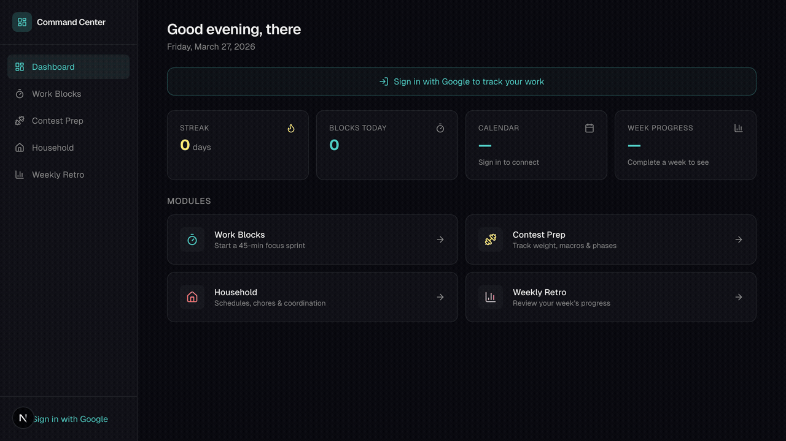

# Daily Command Center

A unified personal productivity dashboard that consolidates work tracking, contest prep, household coordination, and weekly retrospectives into a single app.



## Features

- **Morning Dashboard** — Greeting, streak counter, daily stats at a glance
- **Work Blocks** — 45-minute focus sprint timer with session tracking
- **Contest Prep** — Track weight, macros, and competition phases
- **Household** — Schedules, chores, and coordination
- **Weekly Retro** — Review your week's progress
- **Calendar** — Month and week views with Google Calendar integration

## Tech Stack

- **Framework:** Next.js 16 + TypeScript
- **Styling:** Tailwind CSS v4
- **Database:** Turso (libSQL) + Drizzle ORM
- **Auth:** NextAuth v5 (Google OAuth)
- **Charts:** Recharts
- **Icons:** Lucide React

## Getting Started

1. Clone the repo and install dependencies:

```bash
git clone https://github.com/TyronSamaroo/daily-command-center.git
cd daily-command-center
npm install
```

2. Set up environment variables in `.env.local`:

```env
TURSO_DATABASE_URL=your_turso_url
TURSO_AUTH_TOKEN=your_turso_token
GOOGLE_CLIENT_ID=your_google_client_id
GOOGLE_CLIENT_SECRET=your_google_client_secret
NEXTAUTH_SECRET=your_nextauth_secret
```

3. Push the database schema and start the dev server:

```bash
npx drizzle-kit push
npm run dev
```

Open [http://localhost:3000](http://localhost:3000) to see the app.

## Status

| Phase | Scope | Status |
|-------|-------|--------|
| 1 | Foundation + Work Block Tracker | Done |
| 2 | Contest Prep Snapshot | Not started |
| 3 | Household Coordination | Not started |
| 4 | Google Calendar + Morning Dashboard | Not started |
| 5 | Weekly Retro + Polish | Not started |

See [docs/BUILD_LOG.md](docs/BUILD_LOG.md) for full implementation history and [docs/SYSTEM_DESIGN.md](docs/SYSTEM_DESIGN.md) for architecture.

### Shared utilities

A small set of reusable hooks and helpers backs the modules above:

- `src/hooks/` — `useDebounce`, `useLocalStorage`, `useMediaQuery`, `usePrevious`, `useTimer`, `useToggle`
- `src/lib/utils/` — `dates`, `calculations`, `format`, `group`, `relative-time`, `calendar`
- `src/components/ui/` — `Button`, `Card`, `Modal`, `Badge`

Each is intentionally framework-thin so the next phase can pull them in without leaning on a wider component library.
